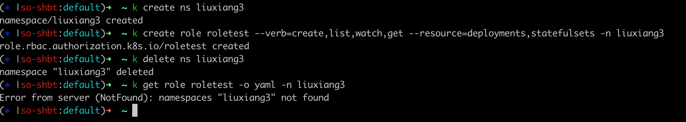
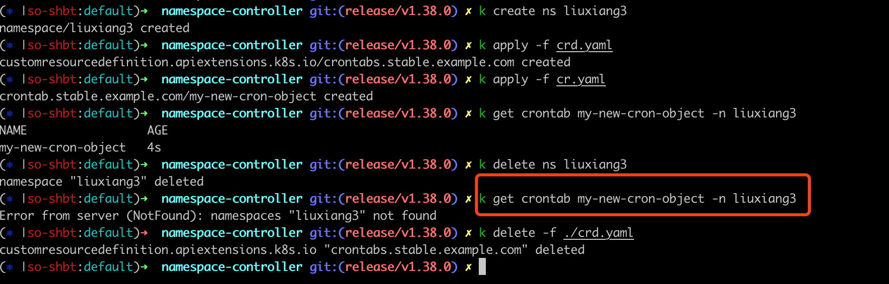

**[浅谈 Kubernetes Namespace Controller 及其工作原理](https://mp.weixin.qq.com/s/PLDwYkrySNw5M8tEPkVjng)**


# Kubernetes学习笔记之namespace controller源码解析

## Overview
本文章基于k8s release-1.17分支代码，代码位于`pkg/controller/namespace`目录。
namespace controller的主要作用是：删除一个namespace时，会删除该namespace下的所有资源对象，包括custom resource等资源。

比如删除一个namespace，该namespace下内置的k8s资源对象role，也会被删除：

```shell
kubectl create ns liuxiang3
kubectl create role roletest --verb=create,list,watch,get --resource=deployments,statefulsets -n liuxiang3
kubectl delete ns liuxiang3
kubectl get role roletest -o yaml -n liuxiang3
#报错： Error from server (NotFound): namespaces "liuxiang3" not found
```



或者删除一个namespace，该namespace下的custom resource对象也会被删除：

```shell
# 参考：https://kubernetes.io/zh/docs/tasks/extend-kubernetes/custom-resources/custom-resource-definitions/
# kubectl apply -f crd.yaml
echo > crd.yaml <<EOF
apiVersion: apiextensions.k8s.io/v1
kind: CustomResourceDefinition
metadata:
  name: crontabs.stable.example.com
spec:
  group: stable.example.com
  versions:
    - name: v1
      served: true
      storage: true
      schema:
        openAPIV3Schema:
          type: object
          properties:
            spec:
              type: object
              properties:
                cronSpec:
                  type: string
  scope: Namespaced
  names:
    plural: crontabs
    singular: crontab
    kind: CronTab
    shortNames:
    - ct
EOF

echo > cr.yaml <<EOF
apiVersion: stable.example.com/v1
kind: CronTab
metadata:
  name: my-new-cron-object
spec:
  cronSpec: "* * * * */5"
EOF

kubectl create ns liuxiang3
kubectl apply -f ./crd.yaml
kubectl apply -f ./cr.yaml
kubectl get crontab my-new-cron-object -n liuxiang3
kubectl delete ns liuxiang3
kubectl get crontab my-new-cron-object -n liuxiang3
#报错： Error from server (NotFound): namespaces "liuxiang3" not found
kubectl delete -f ./crd.yaml
```



那么，namespace controller是如何做到删除一个namespace，会迭代删除该namespace下所有资源对象，包括k8s内置资源对象和custom resource对象的呢？


## 源码解析
NamespaceController也是遵循生产者-消费者模式，分两步：生产者，注册特定资源的事件监听器，并把事件存入队列queue对象里；消费者，启动多个goroutine消费queue对象里的数据，执行相应的业务逻辑，即删除该namespace下的所有资源对象。

### 注册事件监听器
当kube-controller-manager进程启动时，会实例化一批controller，其中包括NamespaceController对象，代码见**[L447-L478](https://github.com/kubernetes/kubernetes/blob/release-1.17/cmd/kube-controller-manager/app/core.go#L447-L478)**:
```go
func startNamespaceController(ctx ControllerContext) (http.Handler, bool, error) {
	// ...
	return startModifiedNamespaceController(ctx, namespaceKubeClient, nsKubeconfig)
}
func startModifiedNamespaceController(ctx ControllerContext, namespaceKubeClient clientset.Interface, nsKubeconfig *restclient.Config) (http.Handler, bool, error) {
	// 实例化
	metadataClient, err := metadata.NewForConfig(nsKubeconfig)

	// ...
	
	// 
	discoverResourcesFn := namespaceKubeClient.Discovery().ServerPreferredNamespacedResources

	// 注册特定资源的事件监听器，并把事件存入队列queue对象里
	namespaceController := namespacecontroller.NewNamespaceController(/*...*/)
	// 消费queue里的数据，执行相应的业务逻辑
	go namespaceController.Run(int(ctx.ComponentConfig.NamespaceController.ConcurrentNamespaceSyncs), ctx.Stop)

	return nil, true, nil
}
```

在实例化NamespaceController时，监听了namespace资源的`add和update`事件，针对每一个事件都会把数据放入queue队列里：
```go
func NewNamespaceController(/*...*/) {
    namespaceController := &NamespaceController{
    	// 该queue对象作为消息队列，存储数据，同时又是限速队列ratelimiting queue和延迟队列delaying queue
        queue:                      workqueue.NewNamedRateLimitingQueue(nsControllerRateLimiter(), "namespace"),
        // 这里实例化namespacedResourcesDeleter对象，该对象执行具体业务逻辑
        namespacedResourcesDeleter: deletion.NewNamespacedResourcesDeleter(/**/),
    }
	// ...
    namespaceInformer.Informer().AddEventHandlerWithResyncPeriod(
        cache.ResourceEventHandlerFuncs{
            AddFunc: func(obj interface{}) {
                namespace := obj.(*v1.Namespace)
                namespaceController.enqueueNamespace(namespace)
            },
            UpdateFunc: func(oldObj, newObj interface{}) {
                namespace := newObj.(*v1.Namespace)
                namespaceController.enqueueNamespace(namespace)
            },
        },
        resyncPeriod,
    )
    // ...
}
const (
    namespaceDeletionGracePeriod = 5 * time.Second 
)
func (nm *NamespaceController) enqueueNamespace(obj interface{}) {
	// 获取namespace的key，即namespace的metadata.name字段值
    key, err := controller.KeyFunc(obj)
    // ...

    namespace := obj.(*v1.Namespace)
    // 如果不是删除namespace，就不会放入队列里；当删除namespace时，namespace.DeletionTimestamp字段值是删除时的时间
    if namespace.DeletionTimestamp == nil || namespace.DeletionTimestamp.IsZero() {
        return
    }

    // 5s后放入队列，这样可以让api-server能观察到该namespace下最新创建的对象
    nm.queue.AddAfter(key, namespaceDeletionGracePeriod)
}
```

总之，生产者已经把需要删除的namespace对象数据放入queue里，逻辑并不复杂。

### 消费队列数据
通过上一步注册namespace资源对象的事件监听器知道，生产者生产数据，当删除一个namespace时，该namespace的name值会在5s后加入queue对象里。
然后需要启动goroutine来消费queue数据：
```go
func (nm *NamespaceController) Run(workers int, stopCh <-chan struct{}) {
	defer utilruntime.HandleCrash()
	defer nm.queue.ShutDown()

	if !cache.WaitForNamedCacheSync("namespace", stopCh, nm.listerSynced) {
		return
	}

	// 启动多个goroutine来消费queue里的数据
	// 每一个goroutine是阻塞的，可以通过stopCh channel来关闭goroutine
	for i := 0; i < workers; i++ {
		go wait.Until(nm.worker, time.Second, stopCh)
	}
	<-stopCh
}

func (nm *NamespaceController) worker() {
    workFunc := func() bool {
        key, quit := nm.queue.Get()
        // ...
        // 从queue中一个个获取数据，并根据namespace值去执行删除逻辑
        err := nm.syncNamespaceFromKey(key.(string))
        if err == nil {
            nm.queue.Forget(key)
            return false
        }
        // ...
        return false
    }

    for {
        quit := workFunc()
        
        if quit {
            return
        }
    }
}
func (nm *NamespaceController) syncNamespaceFromKey(key string) (err error) {
    // ...
	// 调用namespacedResourcesDeleter对象，开始删除namespace下的所有资源对象
    return nm.namespacedResourcesDeleter.Delete(namespace.Name)
}
```

总之，消费者是多个阻塞goroutine，不断的从queue中获取一个个数据值，并执行业务逻辑。当多个goroutine处理queue中的一个item时，这里的queue中的方法，
可以保证同一时刻item只会被一个goroutine处理。

那么，业务逻辑是如何知道该namespace下的所有资源对象的呢？又是如何全部删除这些资源对象的呢？


### 业务逻辑
该业务逻辑主要解决两个关键问题：如何找到该namespace下的所有资源对象；如何高效率地删除这些资源对象。


## 参考文献
**[浅谈 Kubernetes Namespace Controller 及其工作原理](https://mp.weixin.qq.com/s/PLDwYkrySNw5M8tEPkVjng)**

