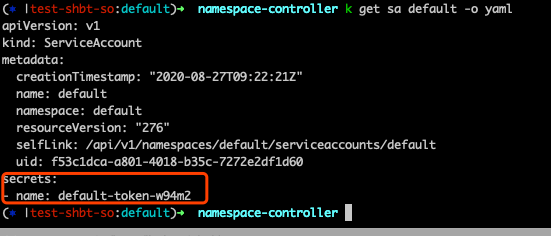

# Kubernetes学习笔记之ServiceAccount AdmissionController源码解析

## Overview
本文章基于k8s release-1.17分支代码，代码位于`plugin/pkg/admission/serviceaccount`目录，代码：**[admission.go](https://github.com/kubernetes/kubernetes/blob/release-1.17/plugin/pkg/admission/serviceaccount/admission.go)** 。

api-server作为常用的服务端应用，包含认证模块Authentication、授权模块Authorization和准入模块Admission Plugin(可以理解为请求中间件模块middleware pipeline)，以及存储依赖Etcd。
其中，针对准入插件，在api-server进程启动时，启动参数`--enable-admission-plugins`需要包含`ServiceAccount`准入控制器来开启该中间件，可以见官方文档：**[enable-admission-plugins](https://kubernetes.io/docs/reference/command-line-tools-reference/kube-apiserver/)** 。
ServiceAccount Admission Plugin主要作用包含：
* 如果提交的pod yaml里没有指定spec.serviceAccountName字段值，该插件会添加默认的`default` ServiceAccount；
* 判断spec.serviceAccountName指定的service account是否存在，不存在就拒绝请求；
* 为该pod创建个volume，且该volume source是SecretVolumeSource，该secret来自于service account对象引用的secret；
* 如果提交的pod yaml里没有指定spec.ImagePullSecrets字段值，那就将service account对象引用的ImagePullSecrets字段值来补位，并且该volume会被
  mount到pod的`/var/run/secrets/kubernetes.io/serviceaccount`目录中；

比如，往api-server进程提交个pod对象：
```shell
echo > pod.yaml <<EOF
apiVersion: v1
kind: Pod
metadata:
  name: serviceaccount-admission-plugin
  labels:
    app: serviceaccount-admission-plugin
spec:
  containers:
    - name: serviceaccount-admission-plugin
      image: nginx:1.17.8
      imagePullPolicy: IfNotPresent
      ports:
        - containerPort: 80
          name: "http-server"
EOF

kubectl apply -f ./pod.yaml
kubectl get pod/serviceaccount-admission-plugin -o yaml
kubectl get sa default -o yaml
```

就会看到该pod对象被ServiceAccount Admission Plugin处理后，spec.serviceAccountName指定了`default` ServiceAccount；增加了个SecretVolumeSource
的Volume，volume name为ServiceAccount的secrets的name值，mount到pod的`/var/run/secrets/kubernetes.io/serviceaccount`目录中；
因为pod和default service account都没有指定ImagePullSecrets值，pod的spec.ImagePullSecrets没有值：


且，volume指定的secret name是default service account的secrets的name值：




那么，ServiceAccount Admission Controller或者说ServiceAccount中间件，是如何做到的呢？

## 源码解析
就和我们经常见到的一些服务端框架做的middleware中间件模块一样，api-server框架也是用插件化形式来定义一个个准入控制器Admission Controller，并且会调用该插件的`Admit()`方法，
来判断当前请求是否通过该准入控制器。

### 准入控制器实例化
实例化操作很简单，需要注意的是：`MountServiceAccountToken`为true，表示默认去执行mount volume操作，且mount到pod的默认目录；当时`Create`操作时去执行当前准入控制器。
代码见 **[L103-L121](https://github.com/kubernetes/kubernetes/blob/release-1.17/plugin/pkg/admission/serviceaccount/admission.go#L103-L121)**：
```go
// 注册到plugin chain中去
func Register(plugins *admission.Plugins) {
  plugins.Register(PluginName, func(config io.Reader) (admission.Interface, error) {
    serviceAccountAdmission := NewServiceAccount()
    return serviceAccountAdmission, nil
  })
}
func NewServiceAccount() *Plugin {
	return &Plugin{
		Handler: admission.NewHandler(admission.Create),
		LimitSecretReferences: false,
		MountServiceAccountToken: true,
		RequireAPIToken: true,
		generateName: names.SimpleNameGenerator.GenerateName,
	}
}
```

### Admit操作
Admit操作是该中间件的核心逻辑，主要工作上文已经详细描述，这里从代码角度学习下，代码见：**[L160-L248](https://github.com/kubernetes/kubernetes/blob/release-1.17/plugin/pkg/admission/serviceaccount/admission.go#L160-L248)**。

#### ServiceAccount 检查
首先是检查pod yaml中有没有指定ServiceAccount，没有指定就设置默认的`default` ServiceAccount对象，并且同时检查该ServiceAccount在当前namespace内是否真的存在：
```go
func (s *Plugin) Admit(/*...*/) (err error) {
	// ...
	// 如果没有指定就设置默认值
    if len(pod.Spec.ServiceAccountName) == 0 {
        pod.Spec.ServiceAccountName = DefaultServiceAccountName
    }
    // 检查该ServiceAccount是否真的存在
    serviceAccount, err := s.getServiceAccount(a.GetNamespace(), pod.Spec.ServiceAccountName)

    // 判断是否可以mount volume，默认可以
    if s.MountServiceAccountToken && shouldAutomount(serviceAccount, pod) {
      if err := s.mountServiceAccountToken(serviceAccount, pod); err != nil {
        // ...
      }
    }
    
    // 如果没有指定ImagePullSecrets，就看ServiceAccount内有没有指定，有指定则补位
    if len(pod.Spec.ImagePullSecrets) == 0 {
      pod.Spec.ImagePullSecrets = make([]api.LocalObjectReference, len(serviceAccount.ImagePullSecrets))
      for i := 0; i < len(serviceAccount.ImagePullSecrets); i++ {
        pod.Spec.ImagePullSecrets[i].Name = serviceAccount.ImagePullSecrets[i].Name
      }
    }
    
    // 还是检查该ServiceAccount是否真的存在
    return s.Validate(ctx, a, o)
}
```

ServiceAccount检查逻辑很简单，主要目的是为pod补位ServiceAccount，因为服务账号就是给pod调用api-server进程用的，关于服务账号ServiceAccount作用可见官网：
**[用户账号与服务账号](https://kubernetes.io/zh/docs/reference/access-authn-authz/service-accounts-admin/#user-accounts-versus-service-accounts)**

#### Mount Volume
Mount Volume核心就是会创建个volume，并mount到pod每个容器内指定目录，该目录下包含`ca.crt、namespace和token文件`，供pod调用api-server时使用。
从源码角度看看如何创建volume以及如何mount的**[L426-L567](https://github.com/kubernetes/kubernetes/blob/release-1.17/plugin/pkg/admission/serviceaccount/admission.go#L426-L567)**：

```go
const (
    DefaultAPITokenMountPath = "/var/run/secrets/kubernetes.io/serviceaccount"
)
func (s *Plugin) mountServiceAccountToken(serviceAccount *corev1.ServiceAccount, pod *api.Pod) error {
	// 首先找到serviceAccount.secrets下的secret的name值，
	// 这里是先list type="kubernetes.io/service-account-token" 的secrets，然后再和serviceAccount.secrets进行匹配，选择第一个匹配成功的。
	// 关于type="kubernetes.io/service-account-token" 服务账号类型的secrets，可以见官网：https://kubernetes.io/zh/docs/concepts/configuration/secret/#service-account-token-secrets
	serviceAccountToken, err := s.getReferencedServiceAccountToken(serviceAccount)
	
	// 如果pod内的volumes已经引用了该secret作为volume，直接跳过
    // ...

	// Determine a volume name for the ServiceAccountTokenSecret in case we need it
	if len(tokenVolumeName) == 0 {
		// 以serviceAccountToken为前缀，加上个随机字符串，生成个volume name
	}

	// 这里挂载到pod每一个容器内的mount path是"/var/run/secrets/kubernetes.io/serviceaccount"
	volumeMount := api.VolumeMount{
		Name:      tokenVolumeName,
		ReadOnly:  true,
		MountPath: DefaultAPITokenMountPath,
	}

	// InitContainers和Containers都要mount新建的volume
	needsTokenVolume := false
	for i, container := range pod.Spec.InitContainers {
		// ...
	}
	for i, container := range pod.Spec.Containers {
		// ...
	}

	if !hasTokenVolume && needsTokenVolume {
		pod.Spec.Volumes = append(pod.Spec.Volumes, s.createVolume(tokenVolumeName, serviceAccountToken))
	}
	return nil
}
// 创建volume对象
func (s *Plugin) createVolume(tokenVolumeName, secretName string) api.Volume {
    // ...
  return api.Volume{
      Name: tokenVolumeName,
      VolumeSource: api.VolumeSource{
          Secret: &api.SecretVolumeSource{
          SecretName: secretName,
        },
      },
    }
  }
```

Mount Volume逻辑也很简单，主要就是为pod创建个volume，并且mount到每一个容器的指定路径。该volume内包含的数据来自于ServiceAccount引用的
secrets的数据，即`ca.crt、namespace和token`数据文件，这些数据是调用api-server时需要的认证数据，且token数据已经经过私钥文件签过过了。

那么有个问题，创建ServiceAccount时对应的这些secret对象是怎么来的呢？secret里的token文件既然已经被私钥签名过，那api-server必然需要对应的公钥
文件来验证签名才对？
至于secret对象是怎么来的问题，这是kube-controller-manager里的ServiceAccount模块的TokenController创建的，创建时会用私钥进行签名，所以
kube-controller-manager启动时必须带上私钥参数`--service-account-private-key-file`，具体可见官网**[service-account-private-key-file](https://kubernetes.io/docs/reference/command-line-tools-reference/kube-controller-manager/)** ；
至于api-server必须使用对应的公钥来验证签名，同理，kube-apiserver启动时，也必须带上公钥参数`--service-account-key-file`，具体可见官网**[service-account-key-file](https://kubernetes.io/docs/reference/command-line-tools-reference/kube-apiserver/)**


## 总结
本文分析了ServiceAccount Admission Controller中间件的主要业务逻辑，如何为pod对象补位serviceAccount、imagePullSecrets以及创建挂载service account volume，
供pod调用api-server使用。总体逻辑比较简单，源码值得学习，供自己二次开发k8s时参考。


## 参考文档
**[serviceaccounts-controller源码官网解析](https://kubernetes.io/zh/docs/reference/access-authn-authz/service-accounts-admin/)**
**[为 Pod 配置服务账户](https://kubernetes.io/zh/docs/tasks/configure-pod-container/configure-service-account/)**
**[服务账号令牌 Secret](https://kubernetes.io/zh/docs/concepts/configuration/secret/#service-account-token-secrets)**
https://github.com/kubernetes/kubernetes/blob/v1.19.0/pkg/controller/serviceaccount/serviceaccounts_controller.go
https://github.com/kubernetes/kubernetes/blob/v1.19.0/pkg/controller/serviceaccount/tokens_controller.go
https://github.com/kubernetes/kubernetes/blob/v1.19.0/plugin/pkg/admission/serviceaccount/admission.go
