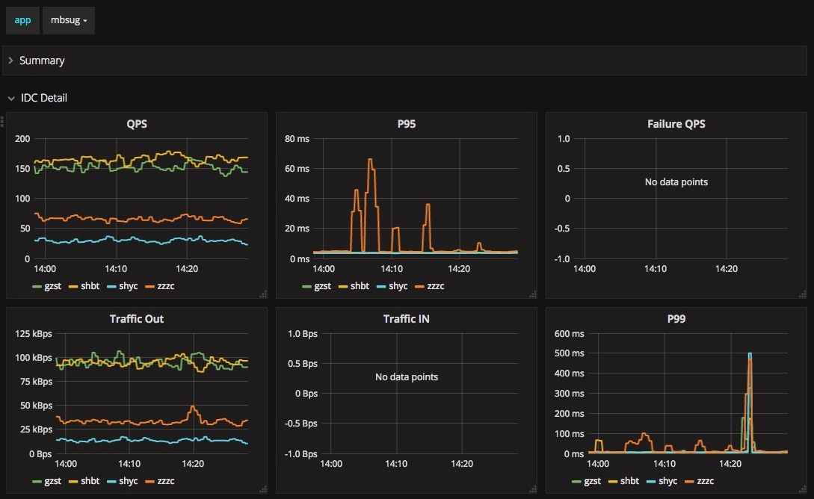

# Prometheus简介
https://prometheus.io/


## 接入须知
为方便业务接入和监控数据聚合，在原有 Client SDK 的的基础上，做了二次封装，可更快捷，方便的接入 prometheus 监控。新的 SDK 预定义了5个统计项，可自定义配置开启和关闭统计项。

| 统计项 | 类别 | 配置名称 | 维度 | 备注 |
| --- | --- | --- | --- | --- |
| QPS |counter | METRIC_COUNTER_RESPONSES|{"app", "api", "module", "method", "code"} | |
| 出口流量 | counter | METRIC_COUNTER_SENT_BYTES | {"app", "api", "module", "method", "code"} | |
| 入口流量 | counter | METRIC_COUNTER_REVD_BYTES | {"app", "api", "module", "method", "code"} | |
| 系统异常 | counter | METRIC_COUNTER_EXCEPTION | {"app", "exception", "module"} | PHP >= 1.0.0，Lua >= 1.1.1 |
| 接口延迟 | histogram | METRIC_HISTOGRAM_LATENCY | {"app", "api", "module", "method"} | |
| 连接状态 | gauge | METRIC_GAUGE_CONNECTS | {"app", "state"} | |

有几点需要注意：
* 接入完成后需要统一配置对外暴露 /metrics 接口，prometheus server 会定时拉取监控数据。
* 大部分业务同时使用了 Lua 和 PHP， 部分监控项（比如Nginx 连接状态）PHP中无法获取。所以 可同时配合使用 Lua 和 PHP SDK，在 Lua 初始化时配置上 merge_path ，最终合并后输出。
* PHP 存储可使用 redis，apc，apcu，memory，推荐使用 apcu 扩展 ，同时 PHP 版本需大于 5.6，小于 5.6 的需要修改部分 SDK 代码。
* 延迟 bucket 配置可使用 histogram（Only for MAC，其他平台请自行编译，代码在文末），执行 ./histogram -min 10 -max 200 -count 20 参数分别是，最小值，最大值，桶数量。PHP 或 Lua 中建议只配置一个，关闭另一个，否则数据聚合会有影响。
* 如果同一机器中有多个服务，可在 log_by_lua_block 配置中，指定 app 区分服务，参考下方示例。

部署须知
监控数据请求的 path 必须是 /metrics，比如：http://10.202.129.195:80/metrics

hulk 或者物理机器部署的项目，需提供各机房的 ip list，用于在 prometheus.yml 文件配置中直接写死。

## Lua项目接入
```nginx
# 假设代码目录结构如下
# /path/to/lua/prometheus
# ├── prometheus.lua
# └── wrapper.lua
lua_package_path "/path/to/lua/?.lua;"
# 注意 name 不要修改
lua_shared_dict prometheus_metrics 10m;

# 建议将 init 相关代码写到文件中
init_by_lua_block {
    local ok, err = require("prometheus.wrapper"):init({
        app = "m_so_com", -- 建议配置成 git 项目名
        idc = lx1036_IDC,
        monitor_switch = {
            METRIC_COUNTER_RESPONSES = {"/s?type=obx", "/status.html"}, -- 支持带参数
            METRIC_COUNTER_SENT_BYTES = {"/s"},
            METRIC_COUNTER_REVD_BYTES = false,
            METRIC_HISTOGRAM_LATENCY = {"/s", "/jump"},
            METRIC_COUNTER_EXCEPTION = true,
            METRIC_GAUGE_CONNECTS = true,
        },
        log_method = {"GET", "POST"}, # 只统计指定的 request method
        # 不要复制 buckets 配置，请自己根据业务生成
        buckets = {10,11,13,15,17,19,22,25,28,32,36,41,47,54,62,71,81,92,105,120,137,156,178,203,231,263,299,340,387,440,500}, -- 桶距配置
        merge_path = "/metrics.php", -- 合并下游统计项
        debug = true -- 用于开发环境调试，init 时不 flush 内存。线上请关闭
    })
    if not ok then
        ngx.log(ngx.ERR, "prometheus init error: ", err)
    end
}
 
server {
    # 添加到业务的 server 配置中
	# 如果有多个 server，可以传入 app 区分不同业务。比如，require("prometheus.wrapper"):log("new_app")
    log_by_lua_block {
        require("prometheus.wrapper"):log()
    }
}

# 单独配置
server {
    listen 8001;
    allow 10.0.0.0/8;
    allow 172.0.0.0/8;
    deny all;
    default_type  text/plain;
	# 注意 path 不要修改
    location /metrics {
        content_by_lua_block {
            require("prometheus.wrapper"):metrics()
        }
    }
	# 下游统计项
    location ~ /metrics.php$ {
        if ( $fastcgi_script_name ~ \..*\/.*php ) {
            return 403;
        }
        fastcgi_pass   fpm.localhost:9000;
        fastcgi_index  index.php;
        include fastcgi.conf;
    }
}
```

自定义 log，添加到 content_by_lua_* 相关代码中（如有需要）
```lua
local wrapper = require("prometheus.wrapper")
-- 以下方法中 module_name，method 和 code 参数 可选，默认是 self，GET 和 200，最后一个参数可重新指定 app
-- histogram
wrapper:latencyLog(2.23, "/get", "searcher", "GET") -- 延迟
-- counter
wrapper:qpsCounterLog(1, "/get", "searcher", "GET", 200, "new_app") -- QPS
wrapper:sendBytesCounterLog(1024, "/get", "searcher", "GET", 200) -- 流量 out
wrapper:receiveBytesCounterLog(2048, "/get", "searcher", "GET", 200) -- 流量 in
wrapper:exceptionLog(1, "mysql_connect_err", "self") -- 异常
-- gauge
wrapper:gaugeLog("alive", "searcher") -- 状态
```

代码示例仓库: https://github.com/360SO/nginx-lua-prometheus

## PHP项目接入
安装
```php
composer require imj/prometheus_client_php_wrapper
```

示例
```php
require __DIR__ . '/../vendor/autoload.php';

// 初始化
PrometheusWrapper\Wrapper::ins()->init([
  "app" => "m_so_com",
  "idc" => "dev",
  "monitor_switch" => [
    PrometheusWrapper\Wrapper::METRIC_COUNTER_RESPONSES => ["/wrapperTest.php?type=obx&name=test"], // 支持带参数
    PrometheusWrapper\Wrapper::METRIC_COUNTER_SENT_BYTES => true, // 开启用于记录下游流量
    PrometheusWrapper\Wrapper::METRIC_COUNTER_REVD_BYTES => true,
    PrometheusWrapper\Wrapper::METRIC_HISTOGRAM_LATENCY => ["/wrapperTest.php"],
    PrometheusWrapper\Wrapper::METRIC_GAUGE_CONNECTS => false, // 关闭统计项
	PrometheusWrapper\Wrapper::METRIC_COUNTER_EXCEPTION => true,
  ],
  "log_method" => ["GET", "POST", "HEAD"], // method 过滤
  "buckets" => [1,2,3,4,5,6,7,8,9,10,11,13,15,17,19,22,25,28,32,36,41,47,54,62,71,81,92,105,120,137,156,178,203,231,263,299,340,387,440,500], // 桶距配置
  "adapter" => "redis", // apcu|apc|memory
  "redisOptions" => [
    'host' => '127.0.0.1',
    'auth' => "123456"
  ],
  "redisIns" => null, // 也可以传入一个 redis 实例
  "handlers" => [
    new \PrometheusWrapper\Handler\ErrorHandler() // 捕捉异常，会自动记录php warning，notice，error，exception counter
  ]
]);

if (isset($_GET['clean'])) {
  // 清除统计数据
  PrometheusWrapper\Wrapper::ins()->flush();
}

// 自定义统计项 以下方法中 module_name，method 和 code 参数 可选，默认是 self，GET 和 200
// histogram
PrometheusWrapper\Wrapper::ins()->latencyLog(rand(1, 20), "/get", "searcher", "GET"); // 延迟
// counter
PrometheusWrapper\Wrapper::ins()->qpsCounterLog(1, "/get", "searcher","GET", 200); // QPS
PrometheusWrapper\Wrapper::ins()->sendBytesCounterLog(1024, "/get", "searcher","GET", 200); // 流量 out
PrometheusWrapper\Wrapper::ins()->receiveBytesCounterLog(2048, "/get", "searcher","GET", 200); // 流量 in
PrometheusWrapper\Wrapper::ins()->exceptionLog(1, "mysql_connect_err"); // 异常
// gauge
PrometheusWrapper\Wrapper::ins()->gaugeLog("alive", "searcher");

// 统计页面
echo PrometheusWrapper\Wrapper::ins();

// 单独统计页面（未做 init 操作，设置 adapter 相关配置即可）
// echo PrometheusWrapper\Wrapper::ins()->setConfig(["adapter" => "redis", "redisOptions" => ['host' => '127.0.0.1', 'auth' => "123456"]]);
```

代码仓库: https://github.com/itsmikej/prometheus_client_php_wrapper

## Go项目接入（GIN框架）
将 qprometheus 包放在项目根目录下，qprometheus 包代码如下：
```go
package qprometheus

import (

"errors"
"github.com/prometheus/client_golang/prometheus"
"strconv"
"strings"
)

type Opts struct {
	AppName   string
	Idc       string
	WatchPath map[string]struct{}
	HistogramBucket []float64
}

var Wrapper *prom

func Init(opts Opts) {
	if strings.TrimSpace(opts.AppName) == "" {
		panic("Prometheus Opts.AppName Can't Be Empty")
	}

	if strings.TrimSpace(opts.Idc) == "" {
		panic("Prometheus Opts.Idc Can't Be Empty")
	}

	if len(opts.HistogramBucket) == 0 {
		panic("Prometheus Opts.HistogramBucket Can't Be Empty")
	}

	p := &prom{
		Appname:   opts.AppName,
		Idc:       opts.Idc,
		WatchPath: opts.WatchPath,
		counter: prometheus.NewCounterVec(
			prometheus.CounterOpts{
				Name: "module_responses",
				Help: "used to calculate qps, failure ratio",
			},
			[]string{"app", "module", "api", "method", "code", "idc"},
		),
		histogram: prometheus.NewHistogramVec(
			prometheus.HistogramOpts{
				Name:    "response_duration_milliseconds",
				Help:    "HTTP latency distributions",
				Buckets: opts.HistogramBucket,
			},
			[]string{"app", "module", "api", "method", "idc"},
		),
	}

	prometheus.MustRegister(p.counter)
	prometheus.MustRegister(p.histogram)

	Wrapper = p
}

func GetWrapper() *prom {
	return Wrapper
}

type prom struct {
	Appname   string
	Idc       string
	WatchPath map[string]struct{}
	counter   *prometheus.CounterVec
	histogram *prometheus.HistogramVec
}

type QPSRecord struct {
	Times float64
	Api string
	Module string
	Method string
	Code int
}

func (p *prom) QpsCountLog(r QPSRecord) (ret bool, err error) {
	if strings.TrimSpace(r.Api) == "" {
		return ret, errors.New("QPSRecord.Api Can't Be Empty")
	}

	if r.Times <= 0 {
		r.Times = 1
	}

	if strings.TrimSpace(r.Module) == "" {
		r.Module = "self"
	}

	if strings.TrimSpace(r.Method) == "" {
		r.Method = "GET"
	}

	if r.Code == 0 {
		r.Code = 200
	}

	p.counter.WithLabelValues(p.Appname, r.Module, r.Api, r.Method, strconv.Itoa(r.Code), p.Idc).Add(r.Times)

	return true, nil
}

type LatencyRecord struct {
	Time float64
	Api string
	Module string
	Method string
}

func (p *prom) LatencyLog(r LatencyRecord) (ret bool, err error) {
	if r.Time <= 0 {
		return ret, errors.New("LatencyRecord.Time Must Greater Than 0")
	}

	if strings.TrimSpace(r.Module) == "" {
		r.Module = "self"
	}

	if strings.TrimSpace(r.Method) == "" {
		r.Method = "GET"
	}

	p.histogram.WithLabelValues(p.Appname, r.Module, r.Api, r.Method, p.Idc).Observe(r.Time)

	return true, nil
}
```

使用该包的代码示例：
```go


package main
import (

"demo_project/qprometheus"
"fmt"
"github.com/prometheus/client_golang/prometheus/promhttp"
	...
)

func run(cmd *cobra.Command, args []string) {
   // Creates a gin router with default middleware:
   // logger and recovery (crash-free) middleware
   r := gin.Default()

   // 接入Prometheus
   if ProjectName != "" {
      qprometheus.Init(qprometheus.Opts{
         Idc:             Idc,
         AppName:         ProjectName,
         HistogramBucket: []float64{1, 5, 10, 20, 30, 35, 40, 50, 60, 76, 80, 90, 100, 200, 400, 600, 1000, 1200, 1300, 1500, 1600, 1800, 2000, 2300, 2500, 2700, 3000, 3300, 3500, 3800, 4000, 4300, 4500, 4800, 5000, 5300, 5500, 5800, 6000, 6300, 6500, 6800, 7000, 7300, 7500, 7800, 8000, 9000, 10000, 11000},
         WatchPath: map[string]struct{}{
            "/json":   {},
            "/_stats": {},
         },
      })

	  // Gin的MiddleWare，go的access日志
      r.Use(promethuesAccessLogger())
      
      // prometheus metrics path
      go func() {
         http.Handle("/metrics", promhttp.Handler())
         fmt.Println(http.ListenAndServe(":18081", nil))
      }()
   }
 
   // 接入sentry
   if _, err := url.Parse(os.Getenv("SENTRY_CONFIG")); err == nil {
      r.Use(sentry.Recovery(raven.DefaultClient, false))
   }
 
   r.GET("/json", jsonHandle())
   r.GET("/_stats", statsHandle())

   // By default it serves on :8080 unless a
   // PORT environment variable was defined.
   r.Run(fmt.Sprintf(":%d", Port))
}
 

// Prometheus access 日志记录
func promethuesAccessLogger() gin.HandlerFunc {
   return func(context *gin.Context) {
      t := time.Now()
      context.Next() // 注意这句，参考：https://lingchao.xin/post/gin-gonic-middleware-theory-and-apply.html
      // 路径限制白名单，
      if _, ok := qprometheus.GetWrapper().WatchPath[context.Request.URL.Path]; ok {

         // Latency
         latencyMS := float64(time.Since(t).Nanoseconds()) * 10e-6
         qprometheus.GetWrapper().LatencyLog(qprometheus.LatencyRecord{
            Time:latencyMS,
            Api:context.Request.URL.Path,
         })

         // QPS
         qprometheus.GetWrapper().QpsCountLog(qprometheus.QPSRecord{
            Times: float64(1),
            Api:context.Request.URL.Path,
            Method: context.Request.Method,
            Code: context.Writer.Status(),
         })

         fmt.Println(context.Request.URL.Path, context.Request.Method, context.Writer.Status(), latencyMS)
      }
   }
}
```

访问http://${YOUR_HOST}:18081/metrics 查看效果。Promethues上面的一些图需要自己写函数画。

Go 项目自定义模块示例:
```go


// cumtomized Latency record example
latencyMS := endTime - startTime // your_api_lantency
qprometheus.GetWrapper().LatencyLog(qprometheus.LatencyRecord{
 	Api:  "your_api_path",	
	Module: "your_module_name",
	Method: "your_api_method",
   	Time: latencyMS
})

// customized QPS recode example
qprometheus.GetWrapper().QpsCountLog(qprometheus.QPSRecord{
   Module: "your_api_module",
   Times:  float64(1), // the number you want to add 
   Api:    "your_api_path", 
   Method: "your_api_method", 
   Code:   200, // your api's code
}) 
 
// 目前只支持以上两个方法，覆盖日常90%的使用；
// 如果有其他需求，需要自己在qprometheus包中添加，具体有哪些Metrics类型，请自行查阅Promethus官方文档
```

## Grafana监控图
代码上线后，项目的基础监控数据可同步实时显示，包括，QPS，流量，延迟等。地址：http://prom.thor.today/?orgId=1，一些自定义的监控项需要单独配置。




### 计算 histogram 算法
```go
package main
import (
	"flag"
	"fmt"
	"math"
)
var (
	min   = flag.Float64("min", 10, "min")
	max   = flag.Float64("max", 200, "max")
	count = flag.Int("count", 20, "count")
)
func main() {
	flag.Parse()
	init_bucket_range(*min, *max, *count)
}
func init_bucket_range(minVal float64, maxVal float64, bucket_count int) {
	var ranges map[int]float64
	ranges = make(map[int]float64)
	log_max := math.Log(maxVal)
	bucket_index := 1
	current := minVal
	ranges[bucket_index] = current
	run := true
	for run == true {
		bucket_index++
		if bucket_count < bucket_index {
			run = false
			continue
		}
		log_current := math.Log(current)
		last_count := bucket_count - bucket_index
		log_ratio := (log_max - log_current) / float64(last_count)
		log_next := log_current + log_ratio
		next := math.Floor(math.Exp(log_next) + 0.5)
		if next > current {
			current = next
		} else {
			current++
		}
		ranges[bucket_index] = current
	}
	for i := 1; i <= bucket_count; i++ {
		if bucket_count == i {
			fmt.Print(ranges[i])
		} else {
			fmt.Print(ranges[i], ",")
		}
	}
}
```
