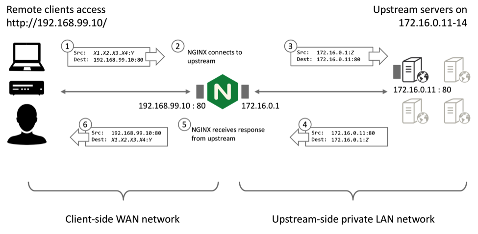

问题：后端 upstream server 需要获取 client ip？

* HTTP 七层：
  * 使用 X-Forwarded-For HTTP header，
  * [PP Proxy Protocol](https://docs.nginx.com/nginx/admin-guide/load-balancer/using-proxy-protocol/)
* TCP/UDP 四层：
  * 使用 transparent proxy 透明代理：https://www.nginx.com/blog/ip-transparency-direct-server-return-nginx-plus-transparent-proxy/#ip-transparency
  * Direct Server Return：https://www.nginx.com/blog/ip-transparency-direct-server-return-nginx-plus-transparent-proxy/#ip-transparency

PP 协议文档：https://www.haproxy.org/download/1.8/doc/proxy-protocol.txt

# Go 代码
https://blog.rajatjindal.com/post/golang-proxy-protocol-http-client/
https://inkel.github.io/posts/proxy-protocol/
https://github.com/inkel/viaproxy
https://github.com/pires/go-proxyproto
https://github.com/mailgun/proxyproto
