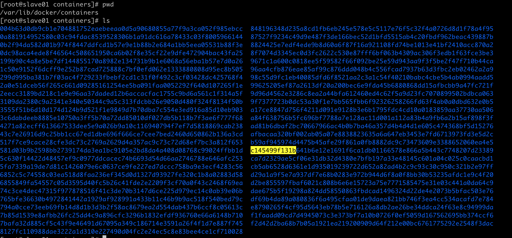

# Filebeat add_kubernetes_metadata 插件源码解析
用户使用指南：https://www.elastic.co/guide/en/beats/filebeat/master/add-kubernetes-metadata.html
字段配置文档：https://www.elastic.co/guide/en/beats/filebeat/current/exported-fields-kubernetes-processor.html

## 背景
该文章分析filebeat版本基于7.10。
部署在k8s上业务pod内各个容器日志可以输出到stdout/stderr，docker的log drivers比如json-file，会把日志根据64位容器id分类，以json形式默认存入
路径下`/var/lib/docker/containers/`：



可以修改`/etc/docker/daemon.json`里的`graph`配置修改日志存储路径。

filebeat的作用是消费这些日志文件，并存入第三方工具如kafka，供后续进一步消费；或者方便测试，直接终端输出。filebeat的标准配置文件类似如下：
```yaml
# filebeat.yaml文件内容如下
filebeat.config.inputs:
  enabled: true
  path: ${path.config}/inputs.yml
  reload.enabled: true
  reload.period: 10s
processors:
  - add_kubernetes_metadata:
        host: slave01
        kube_config: /Users/liuxiang/.kube/config
        in_cluster: true
        matchers:
          - logs_path:
              logs_path: /Users/liuxiang/Code/k8s/beats/filebeat

output.console:
  pretty: true

#output.kafka:
#  hosts: ["127.0.0.1"]
#  topic: "test"

# input.yaml文件内容如下
- type: log
  paths:
    - /Users/liuxiang/Code/k8s/beats/filebeat/51d52e9b3645a9f7d7149d471335ca45bb547d87625999d03b46e252c700a505-json.log
```

## 目的
学习编写filebeat plugin。
学习二次开发k8s。
学习golang。

## add_kubernetes_metadata 插件用途
主要是给每一行日志添加一些k8s相关的元数据metadata字段，比如namespace、deployment/pod name、labels等等。


## 基本概念


### Indexer


### Matcher


## 本地测试


## 工作原理
1. 注册默认indexer和matcher
add_kubernetes_metadata插件启动时，会注册四种indexer: container, pod_name, pod_uid 和 ip_port，和三种matcher: fields, field_format 和 logs_path，
参见 **[L58-L63](https://github.com/elastic/beats/blob/7.10/libbeat/processors/add_kubernetes_metadata/kubernetes.go#L58-L63)** 和 **[L32-L39](https://github.com/elastic/beats/blob/7.10/filebeat/processor/add_kubernetes_metadata/matchers.go#L32-L39)** 。 
并且，filebeat的init函数里设置了默认的container indexer和logs_path matcher。


2. list&watch每个node上的pods
插件初始化代码里，会在goroutine里异步初始化list&watch k8s pods相关代码，见**[L105-L107](https://github.com/elastic/beats/blob/7.10/libbeat/processors/add_kubernetes_metadata/kubernetes.go#L105-L107)**。
最关键的初始化过程在init(kubeAnnotatorConfig, common.Config)函数内，见**[L133-L202](https://github.com/elastic/beats/blob/7.10/libbeat/processors/add_kubernetes_metadata/kubernetes.go#L133-L202)** ：
首先会初始化k8s api-server client:
```go
    // config.KubeConfig 是filebeat.yaml里的配置项'kube_config'
    client, err := kubernetes.GetKubernetesClient(config.KubeConfig)
    ...
```
然后初始化pod watcher，并且指定当前:
```go

```


## 参考文献

